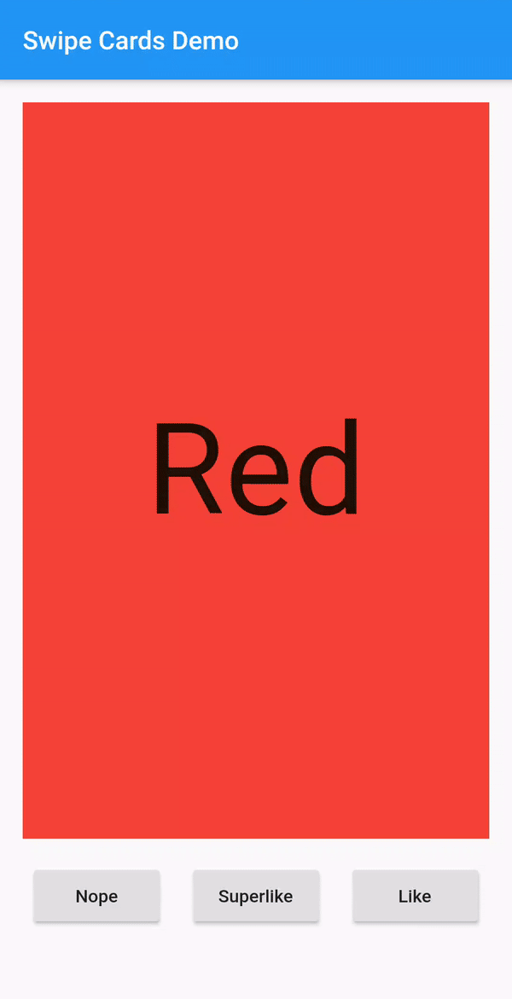

# swipe_cards [](https://pub.dartlang.org/packages/swipe_cards)

A Flutter widget for Tinder like swipe cards. The card can be swiped right, left and up for different responses. Currently it supports the following responses:
- Right swipe for like
- Left swipe for nope
- Up swipe for superlike

## Install
To install the package, add the following dependency to your `pubspec.yaml`
```
dependencies:
  swipe_cards: ^2.0.0+1
```

## Usage

### Basic

```
import 'package:swipe_cards/swipe_cards.dart';

SwipeCards(
            matchEngine: <MatchEngine>,
            itemBuilder: (BuildContext context, int index) {},
            onStackFinished: () {},
            itemChanged: (SwipeItem item, int index) {},
            upSwipeAllowed: <bool>,
            fillSpace: <bool>,
);
```

### Attributes of SwipeCards

| Key                | Description                                                    |
|---------------------|-------------------------------------------------------------------|
| `matchEngine`       |  An instance of `MatchEngine` that acts as controller for trigerring swipes manually.    |
| `itemBuilder`       |  A function that returns the view inside a swipe card.                    |
| `likeTag`           |  Widget appears in like/right area during swipe.                    |
| `nopeTag`           |  Widget appears in nope/left area during swipe.                    |
| `superLikeTag`      |  Widget appears in super-like/up area during swipe.                    |
| `onStackFinished`   |  A function that is triggered as soon as all the cards have been swiped.    |
| `itemChanged`       |  A function that is triggered when item in the stack changes (moves to next card).    |
| `leftSwipeAllowed`  |  To enable/disable left swipe. (Default: true)    |
| `rightSwipeAllowed` |  To enable/disable right swipe. (Default: true)    |
| `upSwipeAllowed`    |  To enable/disable up swipe. (Default: false)    |
| `fillSpace`         |  Config weather to fill up the space or not. (Default: true)    |

### MatchEngine

`MatchEngine` is the controller for the swipe cards. It takes `swipeItems` as an argument and is
used to trigger the swipes manually, for example on button press. The data type of `swipeItems`
is `List<SwipeItem>`.

```
MatchEngine _matchEngine = MatchEngine(swipeItems: List<SwipeItem>);
```

### Functions in MatchEngine

| Key                | Description                                                    |
|-------------------|-------------------------------------------------------------------|
| `_matchEngine.currentItem.like();`    | To trigger right swipe manually.    |
| `_matchEngine.currentItem.nope();`     |  To trigger left swipe manually.                    |
| `_matchEngine.currentItem.superLike();` |  To trigger up swipe manually.    |

### SwipeItem

`SwipeItem` contains the actual data that can be rendered in the swipe card. Actually it is a
wrapper over any dynamic object and just adds the functionality of like, nope and superlike to that
object.

```
SwipeItem(
            content: "Anup Kumar Panwar",
            likeAction: () {
                log("Like");
            },
            nopeAction: () {
                log("Nope");
            },
            superlikeAction: () {
                log("Superlike");
            },
            onSlideUpdate: (SlideRegion? region){
                log("Region $region");
            }
);
```

### Attributes of SwipeItem

| Key                | Description                                                    |
|-------------------|-------------------------------------------------------------------|
| `content`    | An object that contains the actual data to be rendered in the swipe card.    |
| `likeAction`     |  A function that is triggered when the card is liked.                    |
| `nopeAction` |  A function that is triggered when the card is not liked / swiped left.    |
| `superlikeAction` |  A function that is triggered when the card is superliked.    |
| `onSlideUpdate` |  A function that is triggered when the card is being dragged and tells about the current region of the card.    |

### Example

```
List<SwipeItem> _swipeItems = List<SwipeItem>();
  MatchEngine _matchEngine;
  GlobalKey<ScaffoldState> _scaffoldKey = GlobalKey();
  List<String> _names = ["Red", "Blue", "Green", "Yellow", "Orange"];
  List<Color> _colors = [
    Colors.red,
    Colors.blue,
    Colors.green,
    Colors.yellow,
    Colors.orange
  ];

  @override
  void initState() {
    for (int i = 0; i < _names.length; i++) {
      _swipeItems.add(SwipeItem(
          content: Content(text: _names[i], color: _colors[i]),
          likeAction: () {
            ScaffoldMessenger.of(context).showSnackBar(SnackBar(
              content: Text("Liked ${_names[i]}"),
              duration: Duration(milliseconds: 500),
            ));
          },
          nopeAction: () {
            ScaffoldMessenger.of(context).showSnackBar(SnackBar(
              content: Text("Nope ${_names[i]}"),
              duration: Duration(milliseconds: 500),
            ));
          },
          superlikeAction: () {
            ScaffoldMessenger.of(context).showSnackBar(SnackBar(
              content: Text("Superliked ${_names[i]}"),
              duration: Duration(milliseconds: 500),
            ));
          },
          onSlideUpdate: (SlideRegion? region) async {
            print("Region $region");
          }));
    }

    _matchEngine = MatchEngine(swipeItems: _swipeItems);
    super.initState();
  }

  @override
  Widget build(BuildContext context) {
    return Scaffold(
        key: _scaffoldKey,
        appBar: AppBar(
          title: Text(widget.title),
        ),
        body: Container(
            child: Column(children: [
          Container(
            height: 550,
            child: SwipeCards(
              matchEngine: _matchEngine,
              itemBuilder: (BuildContext context, int index) {
                return Container(
                  alignment: Alignment.center,
                  color: _swipeItems[index].content.color,
                  child: Text(
                    _swipeItems[index].content.text,
                    style: TextStyle(fontSize: 100),
                  ),
                );
                  },
                  onStackFinished: () {
                    ScaffoldMessenger.of(context).showSnackBar(SnackBar(
                      content: Text("Stack Finished"),
                      duration: Duration(milliseconds: 500),
                    ));
                  },
                  itemChanged: (SwipeItem item, int index) {
                    print("item: ${item.content.text}, index: $index");
                  },
                  upSwipeAllowed: true,
                  fillSpace: true,
                ),
              ),
              Row(
                mainAxisAlignment: MainAxisAlignment.spaceEvenly,
                children: [
                  RaisedButton(
                      onPressed: () {
                        _matchEngine.currentItem.nope();
                      },
                      child: Text("Nope")),
                  RaisedButton(
                      onPressed: () {
                        _matchEngine.currentItem.superLike();
                      },
                      child: Text("Superlike")),
                  RaisedButton(
                      onPressed: () {
                        _matchEngine.currentItem.like();
                      },
                      child: Text("Like"))
                ],
              )
            ])));
  }
```
```
  class Content {
    final String text;
    final Color color;

    Content({this.text, this.color});
  }
```

## Screenshot

